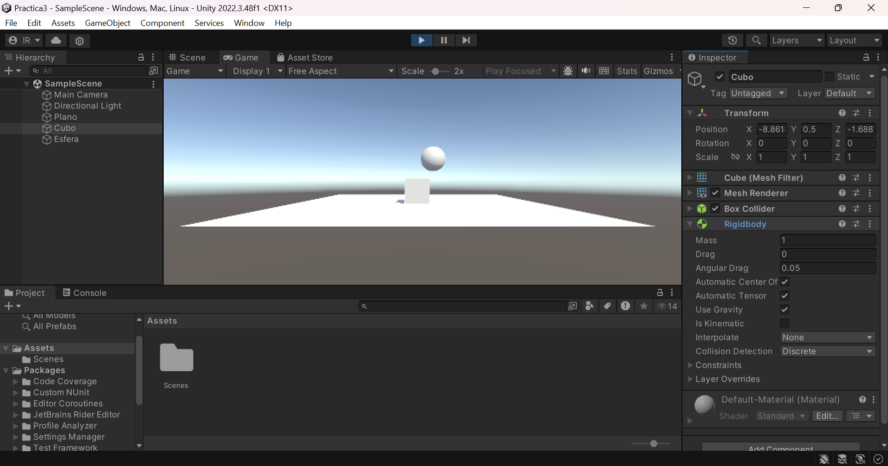
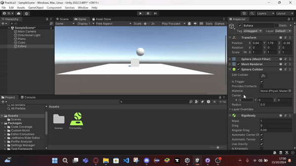

# MovimientoFisicasPractica

## Prueba de Comportamiento de Objetos Físicos en Unity

Este documento describe el comportamiento de una escena de Unity con tres objetos: un plano, un cubo y una esfera, en diferentes configuraciones de Rigidbody y Collider.

### Situación 1
**Descripción:** El plano y la esfera no son objetos físicos. El cubo tiene un Rigidbody.

**Comportamiento:**
- El cubo tiene un Rigidbody y está en contacto con el plano, por lo que no se mueve porque la gravedad ya lo sostiene sobre el plano (con su Collider).
- La esfera no tiene Rigidbody, por lo que no se ve afectada por la gravedad y permanece inmóvil en su posición en el aire.
- El plano tiene solo un Collider y actúa como una superficie estática que no se mueve, deteniendo al cubo al estar en contacto con él.

---

### Situación 2
**Descripción:** El plano no es un objeto físico. El cubo y la esfera tienen un Rigidbody.

**Comportamiento:**
- El cubo, en contacto con el plano, no se mueve al inicio porque está sostenido por su Collider.
- La esfera cae debido a la gravedad, ya que también tiene un Rigidbody, y colisiona con el cubo y el plano, moviéndose como un objeto físico.
- El plano permanece estático, actuando como una superficie de colisión.

---

### Situación 3
**Descripción:** El plano no es un objeto físico. El cubo es un objeto físico y la esfera es cinemática.

**Comportamiento:**
- El cubo, en contacto con el plano, no se mueve porque la gravedad ya lo sostiene.
- La esfera, siendo cinemática, no cae ni se mueve automáticamente, permaneciendo en su posición a menos que se le aplique un movimiento manual.
- El plano sigue siendo estático y actúa como superficie de colisión.

---

### Situación 4
**Descripción:** El plano, cubo y esfera son objetos físicos.

**Comportamiento:**
- Todos los objetos (el cubo y la esfera) tienen Rigidbody, por lo que son afectados por la gravedad y caen.
- El plano, al no ser Kinematic, también cae junto con los otros objetos. Esto significa que el plano no actúa como una superficie sólida y todos los objetos simplemente se mueven hacia abajo.
- Este comportamiento es inesperado, ya que normalmente esperarías que el plano actuara como una superficie en la que otros objetos pueden colisionar y detenerse.

---

### Situación 5
**Descripción:** El plano es físico. El cubo es físico y la esfera tiene 10 veces más masa. *(Kinematic agregado al plano para que actúe como superficie)*

**Comportamiento:**
- El cubo permanece en contacto con el plano sin moverse, mientras que la esfera cae hacia el plano.
- La esfera, al ser más masiva, impacta con mayor fuerza contra el cubo y lo empuja con mayor inercia.

---

### Situación 6
**Descripción:** El plano es físico. El cubo es físico y la esfera tiene 100 veces más masa. *(Kinematic agregado al plano para que actúe como superficie)*

**Comportamiento:**
- El cubo permanece en contacto con el plano. La esfera cae y, al ser mucho más masiva, tendrá mayor inercia.
- La mayor inercia de la esfera provoca que el cubo se desplace más en la colisión.

---

### Situación 7
**Descripción:** El plano es físico. El cubo es físico y la esfera es física con fricción. *(Kinematic agregado al plano para que actúe como superficie)*

**Comportamiento:**
- El cubo permanece en contacto con el plano. La esfera cae hacia el plano y, al tener un material con fricción, puede afectar cómo se mueven y se detienen al chocar. En este caso, simplemente colisiona con el cubo y sale disparada hacia un lado.

---

### Situación 8
**Descripción:** El plano es físico. El cubo es físico y la esfera no es física y es un Trigger. *(Kinematic agregado al plano para que actúe como superficie)*

**Comportamiento:**
- El cubo permanece en contacto con el plano. La esfera, al no ser un objeto físico, no se mueve ni es afectada por la gravedad, pero al ser un Trigger, puede detectar colisiones con otros objetos.

---

### Situación 9
**Descripción:** El plano es físico. El cubo es físico y la esfera es física y es un Trigger. *(Kinematic agregado al plano para que actúe como superficie)*

**Comportamiento:**
- El cubo permanece en contacto con el plano. La esfera, al ser un Trigger, detecta que el cubo y el plano la atraviesan sin colisionar físicamente.

---
