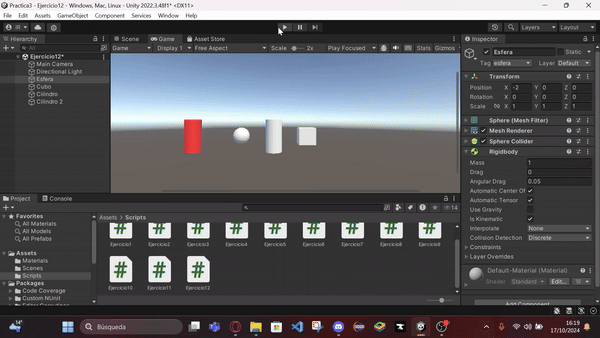
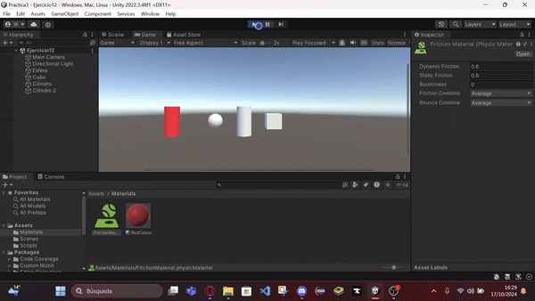

# MovimientoFisicasPractica

## Movimiento - Físicas

Este repositorio contiene 12 ejercicios realizados en Unity, enfocados en el movimiento de un cubo, una esfera y un cilindro, utilizando scripts C# y el sistema de físicas de Unity. A continuación se describen los resultados obtenidos para cada ejercicio, acompañados por GIF de ejecución.

### Ejercicio 1: Campo de Velocidad en el Cubo
- **Descripción**: Se agrega un campo de velocidad al cubo, y se muestra en la consola el producto de la velocidad con los valores de los ejes `Horizontal` y `Vertical` cuando se presionan las flechas de movimiento.
- **Resultado**: El cubo no se mueve, pero en la consola se muestra correctamente la multiplicación de la velocidad por los valores de los ejes cuando se presionan las teclas de flecha.
  

### Ejercicio 2: Mapeo de la Tecla "H" para Disparar
- **Descripción**: Se mapea la tecla "H" a una función de disparo.
- **Resultado**: Cada vez que se presiona la tecla "H", se puede verificar en consola que la acción de disparo está siendo ejecutada.

### Ejercicio 3: Movimiento Proporcional con el Tiempo Transcurrido
- **Descripción**: El cubo se mueve proporcionalmente al tiempo transcurrido (`Time.deltaTime`) en base a un vector de movimiento `moveDirection` y una velocidad `speed`. La dirección del movimiento se puede modificar desde el Inspector y la velocidad es inicializada con un valor mayor a 1.
- **Resultado**: El cubo se mueve suavemente a una velocidad constante, independiente de la velocidad de fotogramas.

  
- **Pruebas**:
  - **Duplicar las coordenadas de la dirección del movimiento**: 
    - 
  - **Duplicar la velocidad manteniendo la dirección del movimiento**: 
    - 
  - **Usar una velocidad menor que 1**: 
    - 
  - **Posición del cubo con `y > 0`**: 
    - 
  - **Intercambiar movimiento relativo al sistema de referencia local y mundial**: 
    - 

### Ejercicio 4: Movimiento de Cubo y Esfera con Teclas Diferentes
- **Descripción**: El cubo se mueve con las flechas del teclado y la esfera se mueve con las teclas `W`, `A`, `S`, `D`.
- **Resultado**: Ambos objetos se mueven en sus respectivas direcciones sin interferencias mutuas.

### Ejercicio 5: Movimiento Proporcional al Tiempo Transcurrido
- **Descripción**: Se adapta el movimiento del ejercicio 4 para que dependa del tiempo transcurrido (`Time.deltaTime`).
- **Resultado**: El cubo y la esfera se mueven de forma suave y constante, sin importar la velocidad de procesamiento del juego.

### Ejercicio 6: Movimiento del Cubo hacia la Esfera
- **Descripción**: El cubo se mueve hacia la posición de la esfera, utilizando un vector normalizado para que el movimiento no dependa de la distancia.
- **Resultado**: El cubo se desplaza hacia la esfera a una velocidad constante, independientemente de la distancia inicial.

### Ejercicio 7: Rotación del Cubo hacia la Esfera
- **Descripción**: El cubo rota hacia la esfera y avanza hacia ella usando el método `LookAt`.
- **Resultado**: El cubo ajusta su rotación de forma gradual para mirar hacia la esfera y avanzar correctamente hacia ella.

### Ejercicio 8: Uso del Eje Horizontal para Girar el Cubo
- **Descripción**: Se utiliza el eje "Horizontal" (`Input.GetAxis("Horizontal")`) para girar el cubo, de forma que siempre avance en la dirección hacia adelante (eje Z positivo).
- **Resultado**: El cubo rota sobre su propio eje y avanza hacia adelante según la rotación.

### Ejercicio 9: Colisiones con el Cilindro
- **Descripción**: El cubo y la esfera colisionan con un cilindro, mostrando en la consola un mensaje con la etiqueta del objeto que colisionó.
- **Resultado**: Las colisiones se detectan correctamente, y se muestra en consola la etiqueta del objeto colisionado (cubo o esfera).

### Ejercicio 10: Configuración de Objetos Cinemáticos y Físicos
- **Descripción**: El cubo se configura como un objeto cinemático y la esfera como un objeto físico. Los scripts se adaptan para obtener el mismo comportamiento que en ejercicios anteriores.
- **Resultado**: El cubo se mueve sin verse afectado por colisiones, mientras que la esfera responde a las físicas e interactúa con el cilindro y otros objetos físicos.

### Ejercicio 11: Cilindro Configurado como Trigger
- **Descripción**: El cilindro se configura como un objeto **Trigger**, permitiendo que el cubo y la esfera lo atraviesen sin colisiones físicas.
- **Resultado**: El cubo y la esfera atraviesan el cilindro, pero los eventos `OnTriggerEnter` se activan y se muestran los mensajes en consola.

### Ejercicio 12: Control de un Segundo Cilindro y Pruebas de Configuraciones
- **Descripción**: Se añade un segundo cilindro controlado por el usuario con las teclas `IJKL`, y se prueban diferentes configuraciones de masa y fricción para la esfera y el cilindro.
- **Resultados**:
  - **Esfera con masa 10 veces mayor**: El cilindro tiene dificultades para mover la esfera debido a su inercia.
    - 
  - **Esfera con masa 10 veces menor**: El cilindro mueve la esfera fácilmente por la diferencia de masa.
    - 
  - **Esfera cinemática**: La esfera no responde a colisiones físicas.
    - 
  - **Esfera como Trigger**: El cilindro atraviesa la esfera sin colisionar, pero se detectan eventos de trigger.
    - 
  - **Cilindro con fricción duplicada**: El cilindro se mueve con mayor dificultad.
    - 
  - **Cilindro con fricción reducida**: El cilindro se desplaza más rápido y libremente.
    - 
